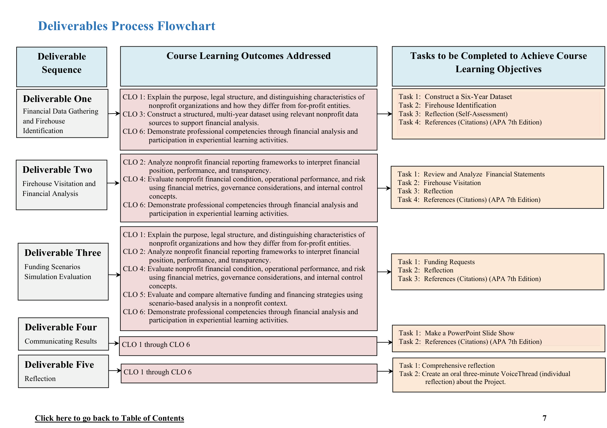

# Project Overview and Objectives

## Purpose

The purpose of the NYC Volunteer Fire Department Project is to connect
the abstract theories a student learns in a typical issues in nonprofit
accounting and/or financial management course, use a venue-based (a place
outside of the classroom) local firehouse as a concrete experience,
engage in active experimentation (applying theory), and reflect on the
experiences. The project requires that students identify and visit an
independent local firehouse and attempt to engage a firefighter to
conduct a short tour of a firehouse and its operations. Inform the
firefighter that you are studying nonprofit accounting and financial
management in school, and you have been tasked to study the financial
aspects of a small nonprofit organization, which requires a basic
understanding of how a firehouse operates. The aim is for students to
gain a more comprehensive understanding of accounting and finance issues
related to nonprofit organizations, and observing and understanding a
local volunteer firehouse serves as a great example. Although many
government-run firehouses are not nonprofit organizations, the equipment
and apparatus they use are similar and can be easily substituted for a
volunteer firehouse.

Another purpose of this project is to help all students further develop
employer-desired competencies and be able to tell a visual and oral story
to potential employers about how they learned nonprofit accounting and
financial management theories and examples of their application.

## Project Learning Objectives

1. Integrate employer-desired competencies to develop highly valued
   employer-desired skills.
2. Construct and analyze a comprehensive financial profile of a
   nonprofit organization using real-world data and field-based
   observations.
3. Analyze real nonprofit financial data and interpret nonprofit
   operations from a nonprofit accounting and financial management
   perspective.
4. Defend evidence-based financial recommendations under realistic
   operational constraints in a nonprofit context.
5. Communicate financial insights and reflect on experiential learning
   to demonstrate professional judgment, analytical thinking, and
   applied competency development.

## Course Learning Outcomes

**CLO 1:** Explain the purpose, legal structure, and distinguishing
characteristics of nonprofit organizations and how they differ from
for-profit entities.

**CLO 2:** Analyze nonprofit financial reporting frameworks to interpret
financial position, performance, and transparency.

**CLO 3:** Construct a structured, multi-year dataset using relevant
nonprofit data sources to support financial analysis.

**CLO 4:** Evaluate nonprofit financial condition, operational
performance, and risk using financial metrics, governance considerations,
and internal control concepts.

**CLO 5:** Evaluate and compare alternative funding and financing
strategies using scenario-based analysis in a nonprofit context.

**CLO 6:** Demonstrate professional competencies through financial
analysis and participation in experiential learning activities.

## Deliverables Process Flowchart

The course step-by-step guide maps each deliverable to the Course Learning
Outcomes addressed and the tasks completed to achieve those objectives
(three columns: Deliverable Sequence → Course Learning Outcomes Addressed
→ Tasks).

Accessible text version of the same flowchart:

| Deliverable Sequence | Course Learning Outcomes Addressed | Tasks to be Completed to Achieve Course Learning Objectives |
|---|---|---|
| **Deliverable One** Financial Data Gathering and Firehouse Identification | **CLO 1:** Explain the purpose, legal structure, and distinguishing characteristics of nonprofit organizations and how they differ from for-profit entities.  **CLO 3:** Construct a structured, multi-year dataset using relevant nonprofit data sources to support financial analysis.  **CLO 6:** Demonstrate professional competencies through financial analysis and participation in experiential learning activities. | Task 1: Construct a Six-Year Dataset Task 2: Firehouse Identification Task 3: Reflection (Self-Assessment) Task 4: References (Citations) (APA 7th Edition) |
| **Deliverable Two** Firehouse Visitation and Financial Analysis | **CLO 2:** Analyze nonprofit financial reporting frameworks to interpret financial position, performance, and transparency.  **CLO 4:** Evaluate nonprofit financial condition, operational performance, and risk using financial metrics, governance considerations, and internal control concepts.  **CLO 6:** Demonstrate professional competencies through financial analysis and participation in experiential learning activities. | Task 1: Review and Analyze Financial Statements Task 2: Firehouse Visitation Task 3: Reflection Task 4: References (Citations) (APA 7th Edition) |
| **Deliverable Three** Funding Scenarios Simulation Evaluation | **CLO 1:** Explain the purpose, legal structure, and distinguishing characteristics of nonprofit organizations and how they differ from for-profit entities.  **CLO 2:** Analyze nonprofit financial reporting frameworks to interpret financial position, performance, and transparency.  **CLO 4:** Evaluate nonprofit financial condition, operational performance, and risk using financial metrics, governance considerations, and internal control concepts.  **CLO 5:** Evaluate and compare alternative funding and financing strategies using scenario-based analysis in a nonprofit context.  **CLO 6:** Demonstrate professional competencies through financial analysis and participation in experiential learning activities. | Task 1: Funding Requests Task 2: Reflection Task 3: References (Citations) (APA 7th Edition) |
| **Deliverable Four** Communicating Results | CLO 1 through CLO 6 | Task 1: Make a PowerPoint Slide Show Task 2: References (Citations) (APA 7th Edition) |
| **Deliverable Five** Reflection | CLO 1 through CLO 6 | Task 1: Comprehensive reflection Task 2: Create an oral three-minute VoiceThread (individual reflection) about the Project |

## Employer-Desired Competencies

Additionally, this assignment is designed to help students develop highly
valued, employer-desired competencies across all industries. The list
below is compiled by Deloitte's Workforce of the Future Institute, as
presented in the course step-by-step guide (Foy, based on Deloitte's
Future of Work Institute) [@deloitteFutureOfWork]. Each term is also
cited to its general-language definition in *Merriam-Webster* for
students who want a plain-English starting point before applying it in a
workplace context.

1. **[Empathy](https://www.merriam-webster.com/dictionary/empathy)** —
   Understanding another person's thoughts and feelings from their point
   of view, rather than one's own (Merriam-Webster, n.d.)
2. **[Adaptability](https://www.merriam-webster.com/dictionary/adaptability)** —
   The ability to adjust to new conditions (Merriam-Webster, n.d.)
3. **[Emotional Intelligence](https://www.merriam-webster.com/dictionary/emotional%20intelligence)** —
   The ability to manage both one's own emotions and understand the
   emotions of people around oneself (Merriam-Webster, n.d.)
4. **[Problem-Solving](https://www.merriam-webster.com/dictionary/problem-solving)** —
   The ability to go through a process of finding solutions to difficult
   or complex issues (Merriam-Webster, n.d.)
5. **[Critical Thinking](https://www.merriam-webster.com/dictionary/critical%20thinking)** —
   The ability to identify a problem and logically think through it to
   find a solution (Merriam-Webster, n.d.)
6. **Logical Reasoning** — The ability to distinguish facts from mere
   opinions. The ability to understand that when important information is
   missing, it is often better to suspend judgment than to jump to
   conclusions
   ([logic](https://www.merriam-webster.com/dictionary/logic);
   [reasoning](https://www.merriam-webster.com/dictionary/reasoning))
   (Merriam-Webster, n.d.).
   *Note:* Merriam-Webster defines *logic* and *reasoning* as separate
   entries, so both dictionary links are included.
7. **[Curiosity](https://www.merriam-webster.com/dictionary/curiosity)** —
   The ability to be eager to know or learn something (Merriam-Webster,
   n.d.)
8. **[Resilience](https://www.merriam-webster.com/dictionary/resilience)** —
   The ability to recover quickly from difficulties or making mistakes
   (Merriam-Webster, n.d.)
9. **[Communication](https://www.merriam-webster.com/dictionary/communication) (Written and Verbal)** —
   The ability to write notes and verbally communicate. The ability to
   pay more attention to important details when it may be needed to make
   a decision (Merriam-Webster, n.d.)

By completing this deliverable, students are not just learning about
nonprofit accounting and financial management. They are building a
foundation of career-ready skills that will help them succeed in any
other future professional setting.
