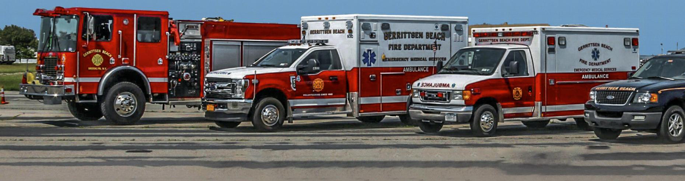
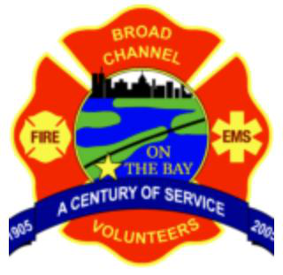
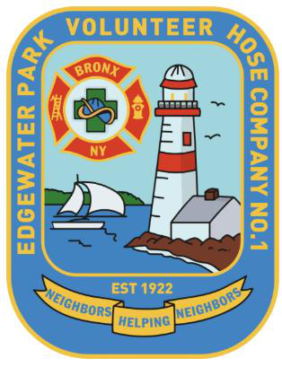
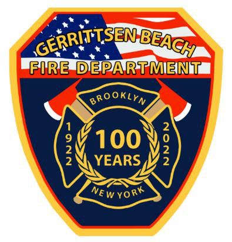
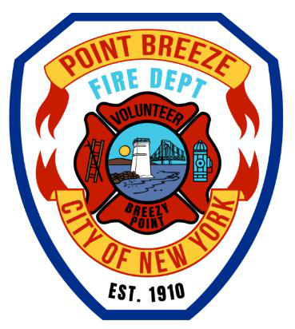
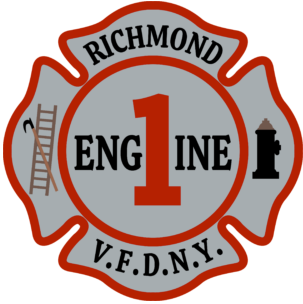
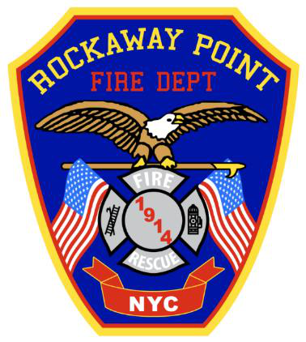
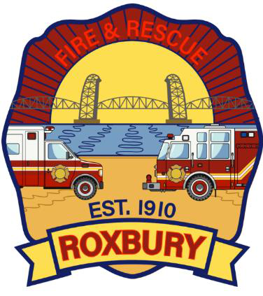
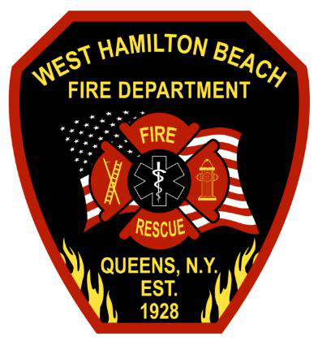

# The NYC Volunteer Fire Department Project

**MGMT 603 — Nonprofit Accounting and Financial Management**
**A Signature Term Experiential Learning Project**

:::{note} About this project
This course places students directly into the context of New York City's
volunteer fire departments — nonprofit organizations balancing public
safety responsibilities with financial sustainability. Students build a
six-year financial dataset covering all NYC volunteer firehouse
nonprofits, visit a local firehouse, simulate funding scenarios, and
communicate findings — connecting classroom theory to real nonprofit
financial decision-making.
:::

## The eight NYC volunteer fire departments

<a href="https://broadchannelvfd.org/" target="_blank" rel="noopener noreferrer" style="display:flex;flex-direction:column;align-items:center;justify-content:center;gap:0.5rem;min-height:8.5rem;padding:0.75rem;border:1px solid #dcd7cf;text-decoration:none;color:inherit;text-align:center;">

Broad Channel
</a>

<a href="https://vfanyc.org/edgewater-park-volunteer-hose-company-no-1/" target="_blank" rel="noopener noreferrer" style="display:flex;flex-direction:column;align-items:center;justify-content:center;gap:0.5rem;min-height:8.5rem;padding:0.75rem;border:1px solid #dcd7cf;text-decoration:none;color:inherit;text-align:center;">

Edgewater Park
</a>

<a href="https://gbfd.net" target="_blank" rel="noopener noreferrer" style="display:flex;flex-direction:column;align-items:center;justify-content:center;gap:0.5rem;min-height:8.5rem;padding:0.75rem;border:1px solid #dcd7cf;text-decoration:none;color:inherit;text-align:center;">

Gerritsen Beach
</a>

<a href="https://www.facebook.com/PointBreezeVFD/" target="_blank" rel="noopener noreferrer" style="display:flex;flex-direction:column;align-items:center;justify-content:center;gap:0.5rem;min-height:8.5rem;padding:0.75rem;border:1px solid #dcd7cf;text-decoration:none;color:inherit;text-align:center;">

Point Breeze
</a>

<a href="https://vfanyc.org/richmond-engine-company-1/" target="_blank" rel="noopener noreferrer" style="display:flex;flex-direction:column;align-items:center;justify-content:center;gap:0.5rem;min-height:8.5rem;padding:0.75rem;border:1px solid #dcd7cf;text-decoration:none;color:inherit;text-align:center;">

Richmond Engine
</a>

<a href="https://rpfdny.org" target="_blank" rel="noopener noreferrer" style="display:flex;flex-direction:column;align-items:center;justify-content:center;gap:0.5rem;min-height:8.5rem;padding:0.75rem;border:1px solid #dcd7cf;text-decoration:none;color:inherit;text-align:center;">

Rockaway Point
</a>

<a href="https://www.facebook.com/RoxburyVolunteerFD/" target="_blank" rel="noopener noreferrer" style="display:flex;flex-direction:column;align-items:center;justify-content:center;gap:0.5rem;min-height:8.5rem;padding:0.75rem;border:1px solid #dcd7cf;text-decoration:none;color:inherit;text-align:center;">

Roxbury
</a>

<a href="https://www.whbvfd.org" target="_blank" rel="noopener noreferrer" style="display:flex;flex-direction:column;align-items:center;justify-content:center;gap:0.5rem;min-height:8.5rem;padding:0.75rem;border:1px solid #dcd7cf;text-decoration:none;color:inherit;text-align:center;">

West Hamilton Beach
</a>

## How this book is organized

- **Introduction** — background on NYC volunteer fire departments and the
  purpose of the project
- **Project Overview and Objectives** — learning objectives and the
  five-deliverable structure
- **Deliverables One through Five** — detailed task instructions for
  each phase of the project
- **Rubrics** — grading criteria for every deliverable
- **Citation Guidance** — APA 7th edition citation and reference examples
- **Student Confidentiality Statement** — research project confidentiality
  pledge
- **Media Gallery** — video reference material on firehouse operations,
  apparatus, and nonprofit funding

**Instructor:** Dr. Joseph Foy, CPA ([joseph.foy@cuny.edu](mailto:joseph.foy@cuny.edu))
